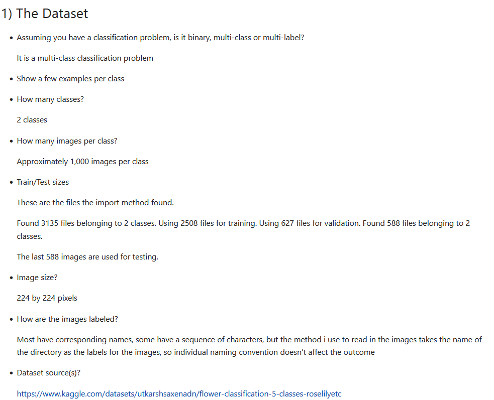
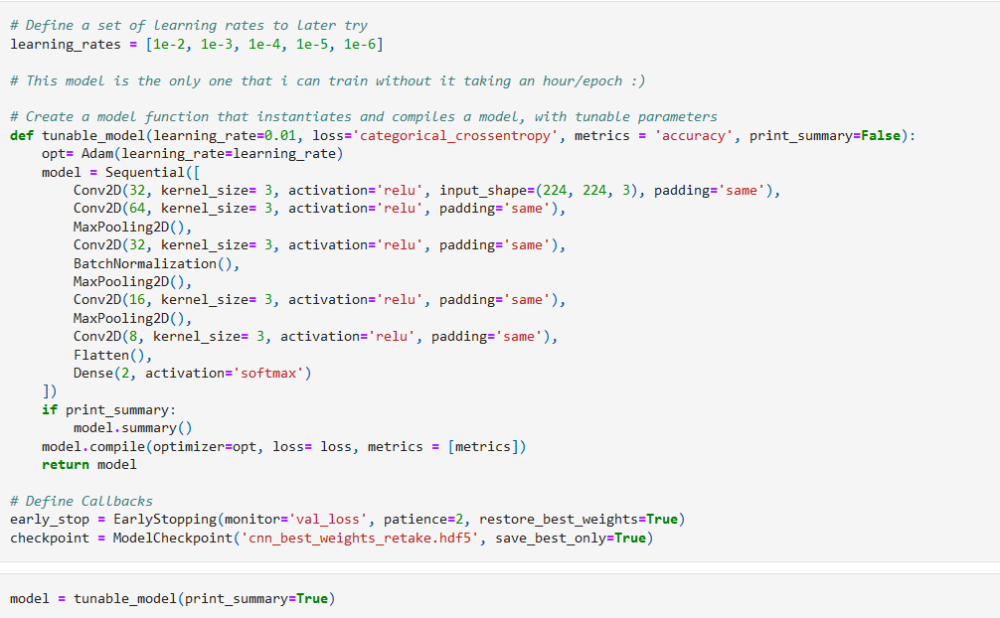
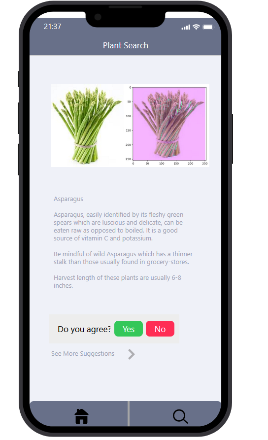

# 3rd Year Data Science & Artificial Intelligence Student

### Portfolio Project: Proof-of-Concept Image Classification Application

**Project Overview**  
In the third quarter of my first year, I developed a proof-of-concept Computer Vision application for image classification using Python and TensorFlow. The objective was to build and train a Multilayered Perceptron (MLP) and a Convolutional Neural Network (CNN) to classify images and compare their performance.

**Key Contributions**
- **Model Development**: Built and trained both an MLP and a CNN to classify images, initially targeting 63 plant species. Due to hardware limitations, I narrowed the task to a binary classification problem, focusing on daisies and sunflowers.
- **Data Processing**: Performed image normalization and created an image generator to augment the training and testing datasets.
- **Application Prototype**: Developed a wireframe for an application that integrates the trained models, allowing users to upload images for classification.

**Tools & Technologies**
- **Python**: TensorFlow, Keras
- **Data Processing**: Pandas, NumPy
- **Model Training**: TensorFlow (MLP, CNN)
- **Prototyping**: Wireframe design for model integration 

**Outcome**
The project successfully demonstrated the models' ability to differentiate between similar plant species, with the CNN showing superior performance. The wireframe prototype provided a clear vision for how the model could be integrated into a user-facing application.

### Portfolio Project: Green Index Analysis for Breda

**Project Overview**  
In the final quarter of my first year, my team explored sustainability solutions for Breda, focusing on the Green Index score—an indicator of the city's environmental sustainability. We aimed to understand why and how the Green Index fluctuates, using data provided by the university and government.

**Key Contributions**
- **Data Processing**: Cleaned and preprocessed data from multiple sources, including Income, Population, Emissions, and Nuisances.
- **Machine Learning**: Evaluated various models and selected a Random Forest Regression model for its effectiveness in predicting Green Index fluctuations.
- **Documentation**: Co-authored a Data Quality Report and researched an Ethical and Legal Checklist to ensure project compliance.
- **Dashboard Development**: Built an interactive Streamlit dashboard to visualize model predictions and allow users to explore factors affecting the Green Index.

**Tools & Technologies**
- **Python**: Data processing (Pandas, NumPy)
- **Scikit-learn**: Random Forest Regression
- **Streamlit**: Interactive dashboard

**Outcome**
The project provided actionable insights into Breda's Green Index, demonstrating the impact of various factors. The Streamlit dashboard enabled stakeholders to interact with the data and predictions in real-time.

### Portfolio Project: Impact of AI and Data Science on Built Environment Professionals and Students

**Project Overview**  
This project explored the impact of Artificial Intelligence (AI) and Data Science on the job market for both Built Environment professionals and students, focusing on their attitudes towards these technological advancements. The research employed both qualitative and quantitative analysis methods to gain a comprehensive understanding of the perspectives from both groups.

**Key Contributions**
- **Research Methods**: Designed and conducted surveys and interviews with both professionals and students to gather data on their attitudes towards AI and Data Science.
- **Data Analysis**: Utilized Python and R to analyze the quantitative survey data, ensuring robust and reliable results.
- **Report Writing**: Authored a detailed research paper documenting our findings, methodologies, and recommendations. The paper also includes a policy proposal for curriculum updates to better prepare both current professionals and students for the evolving job market.

**Outcome**
The study provided valuable insights into how both Built Environment professionals and students perceive the rise of AI and Data Science, and it offered strategic curriculum recommendations. For a deeper understanding of our research and findings, please refer to the attached research paper.

