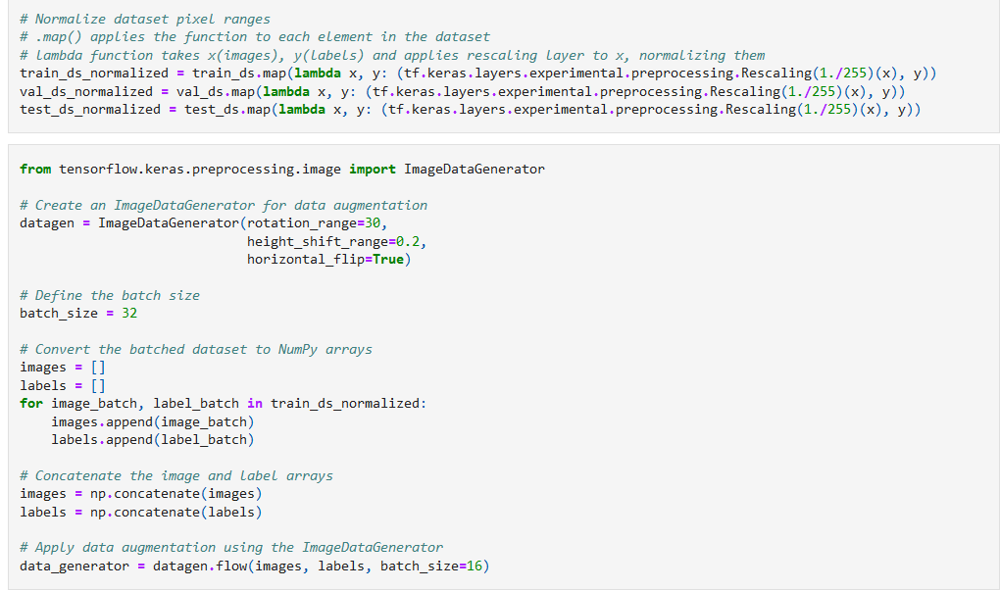

# 3rd Year Data Science & Artificial Intelligence Student

### Portfolio Project: Data Science Foundations and Banijay Group Viewership Analysis

**Project Overview**  
During the first two quarters of my first year, the focus was on building foundational data science skills. We covered various topics in Artificial Intelligence, including its legal and ethical aspects. The coursework included learning the basics of Python (which served as a valuable review for me) and exploring data analysis techniques using Microsoft PowerBI.

**Key Contributions**
- **Python Proficiency**: Enhanced my Python programming skills through various exercises and projects, solidifying my understanding of fundamental concepts.
- **Data Analysis with PowerBI**: Gained practical experience in data visualization and analysis using Microsoft PowerBI, learning how to present data-driven insights effectively.
- **Banijay Group Analysis**: In the second quarter, I applied the skills learned to analyze the Banijay Group's viewership and ratings. This task involved using PowerBI and Python to extract, process, and visualize data, leading to actionable insights.

**Outcome**
The project provided a strong foundation in data science techniques, particularly in using Python and PowerBI for real-world data analysis. The analysis of the Banijay Group's viewership offered practical experience in handling and interpreting media data. For a more detailed exploration, please refer to the brief research paper attached below.

<object data="figs/Tatar_Matyas_223073_Year1BlockBReport.pdf" type="application/pdf" width="100%">
</object>

In the first few quarters, we have also become familiar with self-study and time tracking for reliability. Below you can see an example of how we provide evidence for our learning.

![Worklog example[(figs/worklog_ex.png)

### Portfolio Project: Proof-of-Concept Image Classification Application

**Project Overview**  
In the third quarter of my first year, I developed a proof-of-concept Computer Vision application for image classification using Python and TensorFlow. The objective was to build and train a Multilayered Perceptron (MLP) and a Convolutional Neural Network (CNN) to classify images and compare their performance.

**Key Contributions**
- **Model Development**: Built and trained both an MLP and a CNN to classify images, initially targeting 63 plant species. Due to hardware limitations, I narrowed the task to a binary classification problem, focusing on daisies and sunflowers.
- **Data Processing**: Performed image normalization and created an image generator to augment the training and testing datasets.
- **Application Prototype**: Developed a wireframe for an application that integrates the trained models, allowing users to upload images for classification.

**Tools & Technologies**
- **Python**: TensorFlow, Keras
- **Data Processing**: Pandas, NumPy
- **Model Training**: TensorFlow (MLP, CNN)
- **Prototyping**: Wireframe design for model integration 

**Outcome**
The project successfully demonstrated the models' ability to differentiate between similar plant species, with the CNN showing superior performance. The wireframe prototype provided a clear vision for how the model could be integrated into a user-facing application.

### Portfolio Project: Green Index Analysis for Breda

**Project Overview**  
In the final quarter of my first year, my team explored sustainability solutions for Breda, focusing on the Green Index score—an indicator of the city's environmental sustainability. We aimed to understand why and how the Green Index fluctuates, using data provided by the university and government. This was our first time working as a team using the SCRUM framework. For the sake of experience, scrum masters were rotated every sprint.

**Key Contributions**
- **Data Processing**: Cleaned and preprocessed data from multiple sources, including Income, Population, Emissions, Renewables, and Nuisances.
- **Machine Learning**: Trained and evaluated various models for their effectiveness in predicting Green Index fluctuations, focusing on emissions and renewable energy
- **Documentation**: Authored the Ethical and Legal Checklist to ensure project compliance, contributed and consolidated the Data Quality Report.
- **Dashboard Development**: Helped build an interactive Streamlit dashboard to visualize model predictions and allow users to explore factors affecting the Green Index.

**Tools & Technologies**
- **Python**: Data processing (Pandas, NumPy)
- **Scikit-learn**: Random Forest Regression
- **Streamlit**: Interactive dashboard

**Outcome**
The project provided actionable insights into Breda's Green Index, demonstrating the impact of various factors. The Streamlit dashboard enabled stakeholders to interact with the data and predictions in real-time.

### Portfolio Project: Impact of AI and Data Science on Built Environment Professionals and Students

**Project Overview**  
This project explored the impact of Artificial Intelligence (AI) and Data Science on the job market for both Built Environment professionals and students, focusing on their attitudes towards these technological advancements. The research employed both qualitative and quantitative analysis methods to gain a comprehensive understanding of the perspectives from both groups.

**Key Contributions**
- **Research Methods**: Designed and conducted surveys and interviews with both professionals and students to gather data on their attitudes towards AI and Data Science.
- **Data Analysis**: Utilized Python and R to analyze the quantitative survey data, ensuring robust and reliable results.
- **Report Writing**: Authored a detailed research paper documenting our findings, methodologies, and recommendations. The paper also includes a policy proposal for curriculum updates to better prepare both current professionals and students for the evolving job market.

**Outcome**
The study provided valuable insights into how both Built Environment professionals and students perceive the rise of AI and Data Science, and it offered strategic curriculum recommendations. For a deeper understanding of our research and findings, please refer to the attached research paper.

<object data="figs/Matyas_Y2A_ADSAxBE_Research.pdf" type="application/pdf" width="100%">
</object>

### Portfolio Project: Natural Language Processing Package Development

**Project Overview**  
In the final quarter of my second year, my team developed a comprehensive Natural Language Processing (NLP) package. This package included multiple modules: a Processing module for speech-to-text conversion, a Modeling module for training models, an Inference module for making predictions, and an Evaluation module for assessing the predictions. We also built a basic API to interface with the package, facilitating easy integration into other applications.

**Key Contributions**
- **Data Processing**: Handled the preparation and preprocessing of data for training the NLP models.
- **Model Training**: Trained various models within the package using the Microsoft Azure Machine Learning service.
- **Endpoint Deployment**: Deployed the trained models as endpoints through Azure, enabling seamless access to the models for inference.
- **Interactive CLI Development**: Developed an interactive Command-Line Interface (CLI) to provide users with easy access to all functionalities of the NLP package, including processing, modeling, inference, and evaluation.

**Tools & Technologies**
- **Microsoft Azure**: Data management, model training, and endpoint deployment
- **Python**: Core language for package development and CLI creation
- **NLP Techniques**: Speech-to-text processing, model training, inference, and evaluation

**Outcome**
The NLP package successfully integrated multiple functionalities, from speech processing to model evaluation, in a user-friendly manner. The interactive CLI and API allowed for easy interaction with the package, making it a versatile tool for NLP tasks.

[NLP Package Repository](https://github.com/BredaUniversityADSAI/2023-24d-fai2-adsai-group-nlp2)
